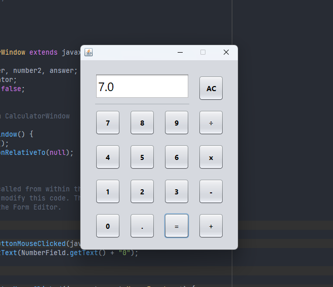
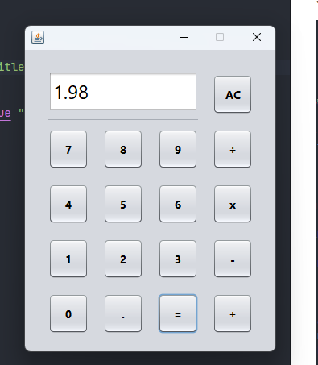

# Java Arithmetic Calcualtor
\
A simple calculator that can perform basic arithmetic operations.\
&nbsp;

## Tools used
- [Swing](https://www.oracle.com/java/technologies/swing-javadocs-2.html)
- [Java](https://www.oracle.com/java/technologies/javadocs-2.html)
- [Netbeans](https://www.netbeans.org/downloads/index.html)

&nbsp;

###### Screenshots

&nbsp;

##### To download this, clone this link (Git must be installed):

https://github.com/ghandylan/java-calculator
###### Give credit to the original author (ghandylan)
